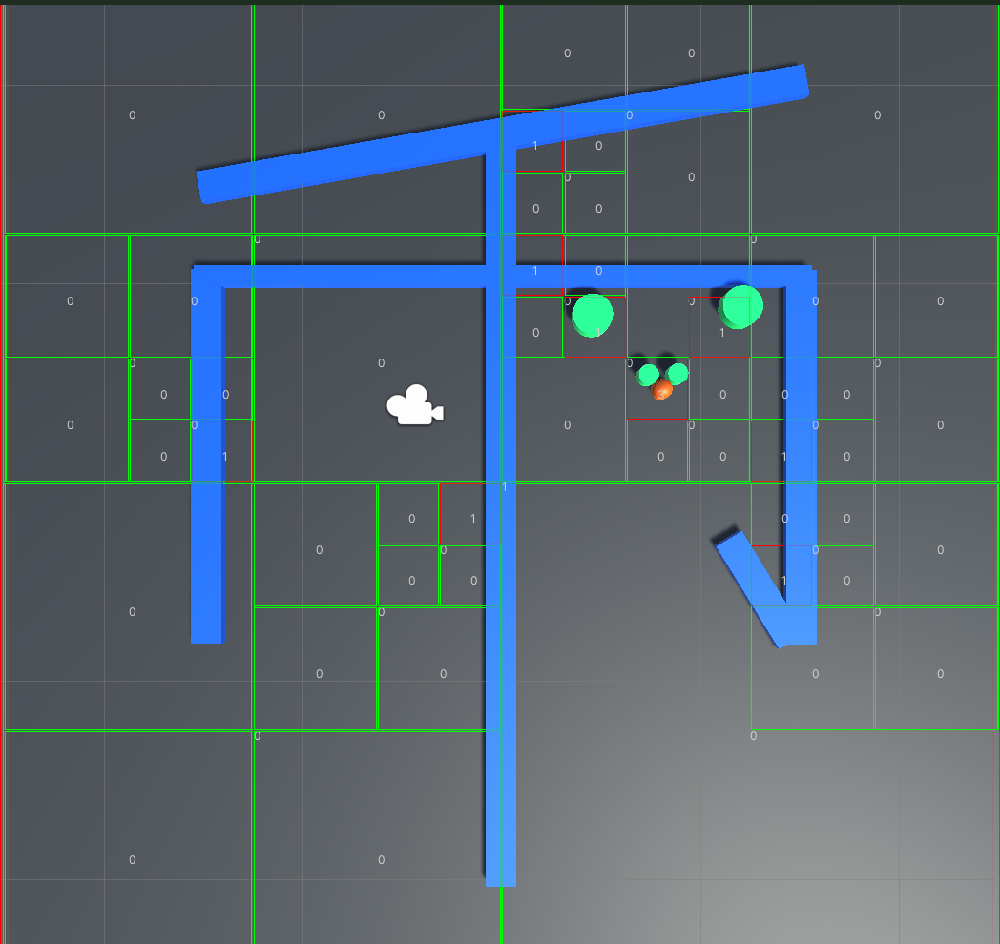

# 基于ecs和动态四叉树的碰撞检测系统

### 动态四叉树场景分割
### 实体组件系统开发模式
### 碰撞检测位置校正
### 支持多物体碰撞
### 逻辑与表现分离

https://www.bilibili.com/video/BV1W94y1573c/?spm_id_from=333.999.0.0&vd_source=7eb72ab765cd160f80bf5acc4f978ae3
